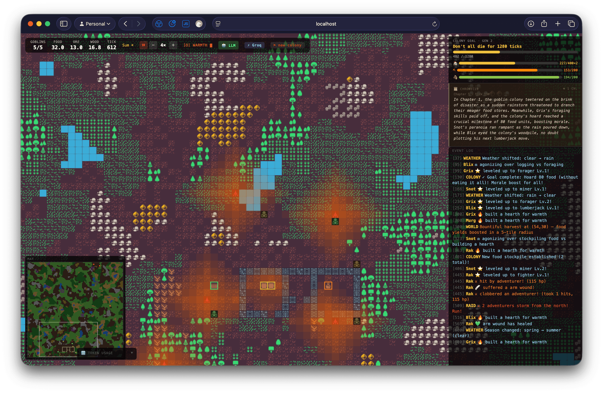

# Kobold — Goblin Colony Sim



A browser-based colony survival game inspired by RimWorld and Dwarf Fortress. Lead a small colony of goblin agents in a tile-based world with emergent behavior arising from resource scarcity.

 

## Quick Start

```bash
npm install
npm run dev
```

Open http://localhost:5173 — use arrow keys to pan, mouse to select goblins.

## LLM Integration

**Required:** Add an API key to `.env.local`:
```
ANTHROPIC_API_KEY=sk-ant-...
```

LLM is off by default. Toggle with 🤖 button in-game. The LLM is used for narrative (chapter summaries when goals complete), not as a chatbot.

## Commands

| Command | Description |
|---------|-------------|
| `npm run dev` | Dev server + LLM proxy |
| `npm run build` | Production build |
| `npm run headless` | Headless sim (2000 ticks) |
| `npx tsx scripts/headless.ts 5000` | Run 5000 ticks |
| `npx tsx scripts/headless.ts 3000 42` | Reproducible run |
| `npx tsc --noEmit` | Type-check |

## Headless Simulation

Run the full simulation without graphics — useful for testing, tuning, and debugging.

```bash
npm run headless                      # 2000 ticks, random seed
npx tsx scripts/headless.ts 5000      # 5000 ticks
npx tsx scripts/headless.ts 3000 42  # reproducible run (seed=42)
DUMP_JSON=1 npx tsx scripts/headless.ts 1000  # full JSON output
```

Output includes survivors, deaths, goals completed, stockpiles, and average needs. The **action frequency table** shows what goblins spend their time on — useful for catching:

- **Score imbalances** — action dominating (>20%) or never firing (<0.5%)
- **Need drift** — hunger/morale trending wrong over time
- **Starvation cascades** — deaths clustered in specific tick ranges

### Healthy Action Ranges

| Action | Expected |
|--------|----------|
| traveling | 40–55% |
| exploring | 15–30% |
| harvesting | >1% |
| socializing | <8% |
| fleeing to safety | <5% |
| idle | <2% |

## Gameplay

- **5 goblins** with distinct roles (forager, miner, scout, lumberjack, fighter)
- **Tile-based world** with procedural generation
- **Needs system**: hunger, warmth, fatigue, morale, social
- **Raids**: defend against adventurers
- **Goals**: stockpile food, survive ticks

## Architecture

- **Phaser 3** — game rendering
- **React 19** — HUD overlay
- **rot.js** — A* pathfinding
- **Utility AI** — deterministic action scoring
- **LLM (claude-haiku)** — storyteller (chapter summaries) only

## Tech Stack

TypeScript 5 · Vite 7 · Phaser 3.90+ · React 19 · rot.js 2 · Kenney 1-bit Pack (CC0)

## Credits

- Kenney 1-bit Pack (CC0) for tiles
- Design influences: Sugarscape, PIANO architecture, RimWorld
